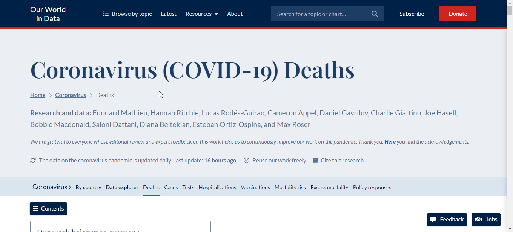
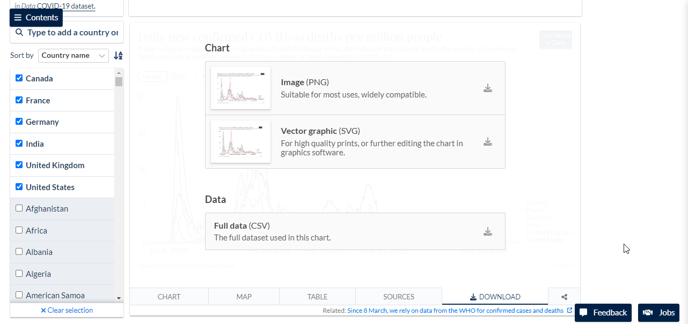

# Covid-19 Exploratory Data Analysis (June 2023)

## Introduction
This repository contains the code and data for a comprehensive exploratory data analysis of COVID-19 data collected from the Ourworlddata website. The data includes the total number of cases and deaths and the number of new cases and deaths for each country and continent.

The analysis was conducted using the SQL programming language and the following queries include:

- Common Table Expression (CTE)
- TEMP Table
- SQL View

The analysis also includes several visualizations using Tableau that help to illustrate the findings.

## Objective
The objective of this documentation is to provide a comprehensive and informative overview of the COVID-19 data collected from the Ourworlddata website. The documentation will include the following:

- A description of the data, including the variables and their definitions.
- A summary of the data, including the total number of cases and deaths, and the number of new cases and deaths for each country and continent.
- An analysis of the data, using SQL queries to explore trends and patterns.

## Data
The Coronavirus Covid-19 (Deaths) data collected from [here](https://ourworldindata.org/covid-deaths) contains 320,000+ observations of various countries across the different continents. The data spans from January 2020 to June 2023 highlighting the number of death cases, administered vaccines, and human development index amongst other variables.  

##

To select your preferred country and data range, simply scroll down to the data explorer as depicted in the image below. This data may have been updated from the time of this report. 

_Disclaimer: All datasets and reports do not represent any institution or country, but a personal project to demonstrate capabilities of using SQL for data analysis and Tableau for data visualization._ 

